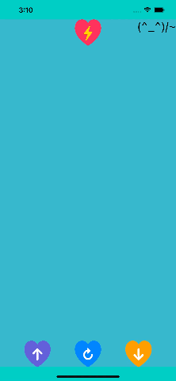

# TooltipKitSwiftUI

This package provides you with an easy way to show a tooltip like a chat bublle or a balloon. See the animation below for more details.



You can add this package on Xcode.
See [documentation](https://developer.apple.com/documentation/swift_packages/adding_package_dependencies_to_your_app).


## How to Use

You can just import `TooltipKitSwiftUI` to use the package.

### TooltipView

*TooltipView* is a view in SwiftUI.

```swift
  TooltipView(configuration: TooltipConfiguration, at location: CGPoint, screenBounds: CGRect, hidden: Bool, @ViewBuilder content: () -> Content)
```

*TooltipConfiguration* is setup the cotnent size and the color of the tooltip.
Static computed properties available are '.small', '.default', and '.large'.

```swift
  TooltipConfiguration(contentSize: CGSize, tintColor: Color = .pink)
```

#### Example Source Code

```swift
import SwiftUI
import TooltipKitSwiftUI

struct ContentView: View
{
  var body: some View {
    GeometryReader { proxy in
      let location: CGPoint = {
        let x = proxy.size.width * 0.5
        let y = proxy.size.height * 0.5
        return .init(x: x, y: y)
      }()
      ZStack {
        TooltipView(configuration: .large.tintColor(.blue), at: location, screenBounds: proxy.frame(in: .named("screen")), hidden: false) {
          Text("TooltipView").font(.title)
          Text("The direction and the position of the arrows are set automatically.")
        }
      }
      .frame(width: proxy.size.width, height: proxy.size.height)
      .coordinateSpace(name: "screen")
    }
    .background(Color.mint)
  }
}
```

### tooltip ViewModifier

*tooltip* is a custom ViewModifier in SwiftUI. You can easily display a tooltip in any view.

```swift
  tooltip(configuration: TooltipConfiguration, hidden: Bool = true, @ViewBuilder content: @escaping () -> Content) -> some View
```

#### Example Source Code

```swift
import SwiftUI
import TooltipKitSwiftUI

struct ContentView: View
{
  var body: some View {
    VStack {
      Spacer()
      Rectangle()
        .frame(width: 128, height: 128)
        .foregroundColor(.yellow)
        .tooltip(configuration: .default.tintColor(.mint), hidden: false) {
          Text("Hello TooltipKit. This is 'tooltip' ViewModifier.")
            .lineLimit(nil)
        }
      Spacer()
    }
  }
}
```

## License

This package is licensed under [BSD License](LICENSE)
